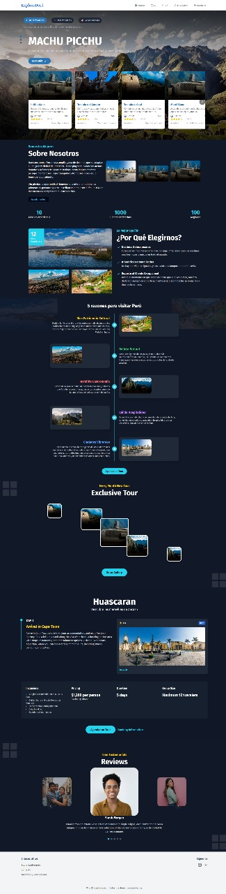

# Make It Real - ExploraPerú 🧳

ExploraPerú is a web application designed to promote tourism across the diverse regions of Peru. It enables tourists to book tours from travel agencies certified by MINCETUR, ensuring trust and reliability. This project is the solution to the group assignment for the Make It Real bootcamp.

## Table of Contents

- [Overview](#overview)
  - [The Challenge](#the-challenge)
  - [Screenshot](#screenshot)
- [Our Process](#our-process)
- [Built With](#built-with)
- [API Usage](#api-usage)
- [Authors](#authors)
- [Acknowledgments](#acknowledgments)

## Overview

### The Challenge

Users should be able to:

- **User and agency registration and authentication:** Tourists can sign up to request more information, and travel agencies can register their profiles and tour offerings.
- **Store information in a database:** Includes user and agency data, regional details, tour information, payments, and agency-user chats.
- **Image upload and email notifications:** Users can upload profile pictures, receive notifications when creating an account, and get notified of pending messages after booking a tour.
- The app must include at least one of the following features:
  - **Payments:** Secure booking transactions, similar to platforms like Airbnb.
  - **Tourist information map:** Display a map with pre-established tourist spots.
  - **Real-time communication (WebSockets):** Implement a live chat feature for users to communicate with agencies.

### Screenshot

<div align="center">
  
</div>

## Our Process

- **Sprint 1:** Brainstorming ideas for the project, creating a visual sitemap using [Octopus.do](https://share.octopus.do/embed/ddn3ssxynzh), and setting up the product backlog in Jira.
- **Sprint 2:** Designing the system (fonts, colors, icons with `lucide-react`), setting up the project with Vite and React using TypeScript + SWC, and configuring tools like Prettier, ESLint, Husky, lint-staged, commitlint, and pnpm. Additionally, setting up the GitHub repository with Gitflow, developing the initial components (some adapted from Shadcdn), and setting up page routing using React Router.
- **Sprint 3:** Updating the README, mocking API requests using `json-server`, and improving UX (dark mode, form enhancements).

## Built With

**Frontend:**

- Mobile-first workflow
- Semantic HTML5 markup
- Tailwind CSS
- React with TypeScript

**Backend:**

- Node.js (Express) with TypeScript
- PostgreSQL for database management

**Operations:**

- Deployed on Vercel
- End-to-end testing with Cypress

## API Usage

Here are some examples of how to interact with the ExploraPerú API for various operations:

### Get All Users (GET)

This request retrieves all registered users.

```bash
GET http://localhost:3000/users
```

### User Registration (POST)

This request registers a new user in the system.

```bash
POST http://localhost:3000/users
Content-Type: application/json
{
  "name": "Jose",
  "lastName": "Campos",
  "documentType": "DNI",
  "documentNumber": 12345678,
  "birthdate": "1990-05-01",
  "country": "Peru",
  "gender": "male",
  "phone": "+51987654321",
  "password": "securepassword",
  "email": "jose@example.com"
}
```

### Update User (PATCH)

This request updates an existing user's information.

```bash
PATCH http://localhost:3000/users/{id}
Content-Type: application/json
{
  "name": "Luis",
  "lastName": "Flores",
  "phone": "+51987654321",
  "password": "newsecurepassword",
  "email": "jose.r@example.com"
}
```

### Delete User (DELETE)

This request deletes a user from the system.

```bash
DELETE http://localhost:3000/users/{id}
```

### Get Comments (GET)

This request retrieves all comments from the server.

```bash
GET http://localhost:3000/comments
```

### Search Tours (GET)

This request retrieves all available tours based on criteria like region or price.

```bash
GET http://localhost:3000/tours
```

### Create a New Tour (POST)

### This request creates a new tour in the system.

This request retrieves all available tours based on criteria like region or price.

```bash
POST http://localhost:3000/tours
Content-Type: application/json
{
  "name": "Machu Picchu Adventure",
  "region": "Cusco",
  "price": 1200,
  "rating": 4.8,
  "duration": 12
}
```

### Update a Tour (PUT)

### This request updates an existing tour.

This request retrieves all available tours based on criteria like region or price.

```bash
PUT http://localhost:3000/tours/{id}
Content-Type: application/json
{
  "name": "Amazon Rainforest Expedition",
  "region": "Loreto",
  "price": 1500,
  "rating": 4.9,
  "duration": 7
}
```

### Delete a Tour (DELETE)

This request deletes a tour from the system.

```bash
DELETE http://localhost:3000/tours/{id}
```

## Authors

Full stack Developers:

- Jaqueline Rocio - [@JaquelineRocio](https://github.com/JaquelineRocio)
- Heberth López - [@heblopez](https://github.com/heblopez)
- Victor Ramirez - [@Victormrl17](https://github.com/Victormrl17)
- Juan Alva - [@jlac8](https://github.com/jlac8)

## Acknowledgments

A special thanks to Make it Real, especially [@khriztianmoreno](https://github.com/khriztianmoreno) for the valuable feedback during daily meetings and demos, and to [@nayruthCalla](https://github.com/nayruthCalla) for the support and review.
